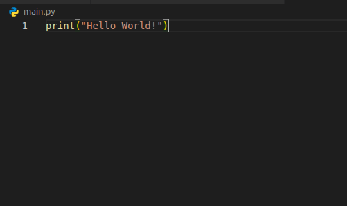

# Dastur va Python dasturlash tili haqida

## Dastur o'zi nima?

### Ta'rif

**Dastur** - bu yuqoridan pastgacha bajariladigan **ko'rsatmalar yoki buyrug'lar ketma-ketligi**
Real hayotga tatbiq:

* Boshliq va ishchi o'rtasida topshiriqlar ketma-ketligi va ishchi tomonidan ularni birma-bir bajarilishi.
* Avtomobil ichidagi haydovchiga ko'rinmas mexanizmlarning haydovchi boshqaruviga qarab bajarilishi
* Murakkab dasturlarga misol, bir korxonani ichida xodimlarni o'zlarini rollariga qarab topshiriqlarni bajarishi. Bunda boshliq biz dasturchilar hisoblanadi, undagi ma'lum rollardagi xodimlar esa dasturning ichidagi bir nechta xususiyatlarga ega bloklar yoki funksiyalar.

### Dasturlarga misol

* Google Chrome
* Microsoft Office dasturlari (Excel, Word, Powerpoint, etc)
* GTA 5 (Grand Theft Auto)
* Counter Strike 2.0
* Steam
* Spotify

Shu jumladan Python dasturlash tilining ham o'zini dasturi mavjud. Bu dastur dasturchilar kod yozib dastur yaratishlari uchun **[Interpretator](https://en.wikipedia.org/wiki/Interpreter_(computing))** vazifasini bajaradi, ya'ni yozilgan kodni olib, kompyuterda ishga tushirib beradi. Buning ortida bir nechta texnik qadamlar mavjud, lekin bularga keyinro to'xtalamiz.

## Dasturlash tili nima?

Dasturlash tili o'z nomi bilan aytib turganidek, kompyuter bizning buyrug'lar to'plami bo'lgan *dastur*imizni tushunishi uchun **til** hisoblanadi. Real hayotda ham muloqot qilish uchun yuzlab tillar mavjud. Dasturlash olamida esa, dasturlash tili dasturchi va kompyuter o'rtasida til vazifasini bajaradi.
Dasturlash tillariga misol:

* Python
* C/C++/C#
* Java
* JavaScript
* Go
* PHP va hokazolar

## Python nima?

**Python** — bu yuqori darajadagi, o‘qilishi oson va kuchli **dasturlash tili** bo‘lib, u 1991-yilda **[Guido van Rossum](https://en.wikipedia.org/wiki/Guido_van_Rossum)** tomonidan yaratilgan. Pythonning asosiy maqsadi — dasturchiga murakkab masalalarni **kam kod, aniq sintaksis va yuqori samaradorlik** bilan yechish imkonini berish hisoblanadi.

### Python Dasturlash tilini kompyuterga o'rnatish

Python dasturlash tilida kod yozish uchun avval, python ilovasini kompyuterga yuklab olish va o'rnatish kerak. Python dasturlash tilining rasmiy saytiga tashrif buyurish orqali uning "installer"ini yuklab olinadi, so'ng yuklangan ilovani ishga tushiriladi.

## Python dasturlash tilida sodda kod

Quyidagi rasmda python dasturlash tilida yozilgan kod ko'rsatilgan.

Ushbu kodni python *interpretatori* orqali ishga tushirilganda kompyuterda bizga ko'rinmas bir nechta qadamlar bajariladi.

[Keyingi Dars](lesson2.md)

[Asosiy sahifa](../README.md)

