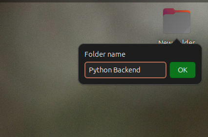
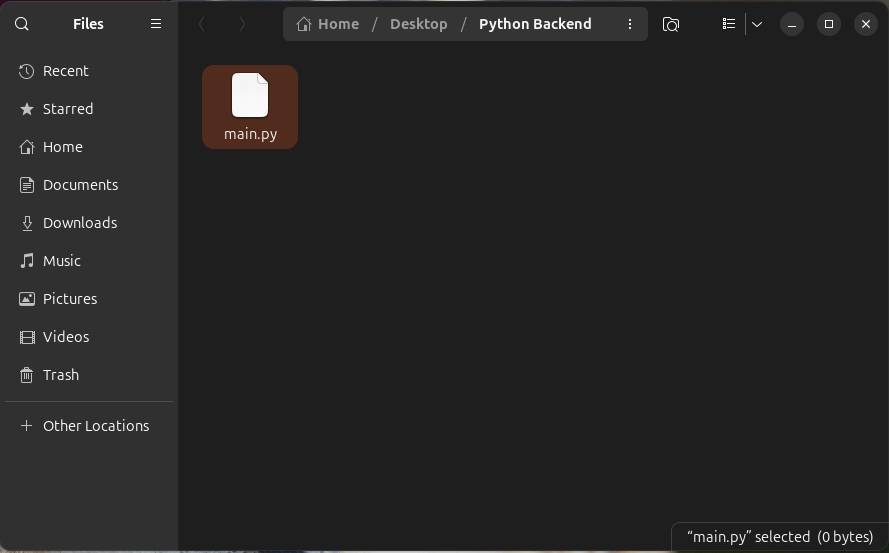
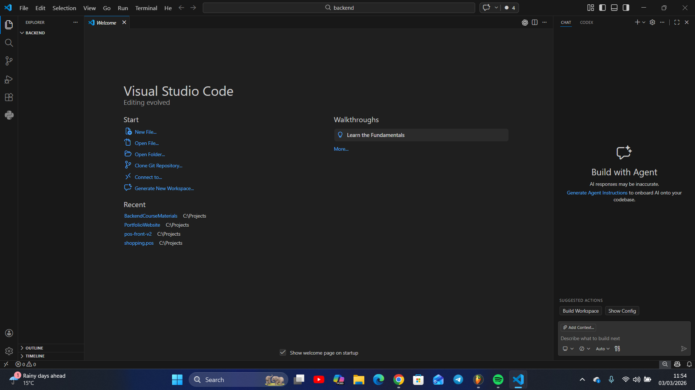
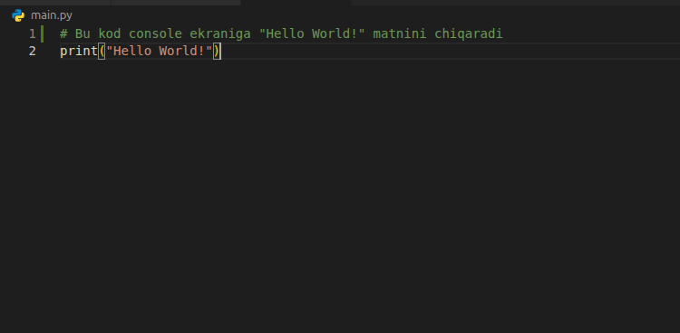

# Birinchi Python dasturini yozish va muhit yaratib olish

Har qanday ish qilishda doim o'zingizga qulay muhit yaratib olishingiz muhim hisoblanadi. Dasturlashda ham, dastur yozish uchun kompyuteringizda qulay muhit va sharoitlar mavjud bo'lishi kerak.

## Bugungi darsda o'rgatiladigan mavzular

* Birinchi dastur yozish uchun muhit yaratish, papka ochish, **main.py** faylini ochish
* VS Code dasturini o'rnatish
* Hash tag kommentariya belgisi haqida
* o'zgaruvchilar haqida qisqacha

### Birinchi dasturimizni yozish uchun muhit yaratish

Avvalo, kompyuterimizning topishga oson joyidan yangi papka ochib olamiz. 
 
So'ng, uning ichiga kirib, yangi fayl ochib olamiz, va fayl formatini **.py** qilib ochamiz. 

### VS Code Dasturini o'rnatish

#### VS Code nima?

**VS Code** - Visual Studio Code — bu **Microsoft** tomonidan yaratilgan, dasturchilar orasida eng mashhur **kod muharriri** (code editor) hisoblanadi. U bepul, yengil va juda ko'p dasturlash tillarini, jumladan Pythonni ham qo'llab-quvvatlaydi. VS Code'da kod yozish, xatolarni topish va dasturni ishga tushirish mumkin. [Rasmiy link](https://code.visualstudio.com/download) orqali VS code dasturini yuklab olamiz va kompyuterimizga o'rnatamiz 

### Hash Tag kommentariyasi

**Hash Tag** - dastur yozish davomida kodning ma'lum qismlariga kommentariya qoldishish uchun ishlatiladi. Kommentariya qo'shish bir qarashda keraksiz narsadek ko'rinadi, lekin dastur judayam kattalashganda, kodning ma'lum qismlari nima uchun yozilganini boshqa dasturchilar osonroq tushunishi uchun qoldirib ketiladi. Undan tashqari, vaqtinchalik keraksiz kodlarni shunchaki kommentariyaga olib qo'yiladi. 

